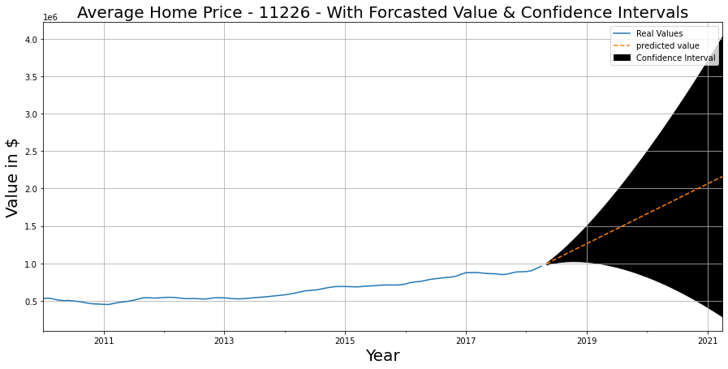
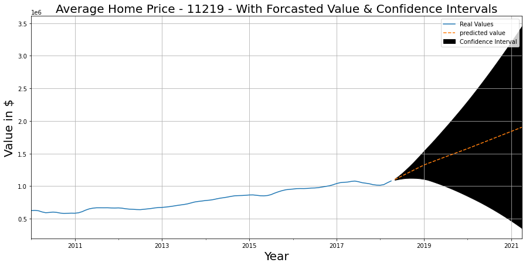
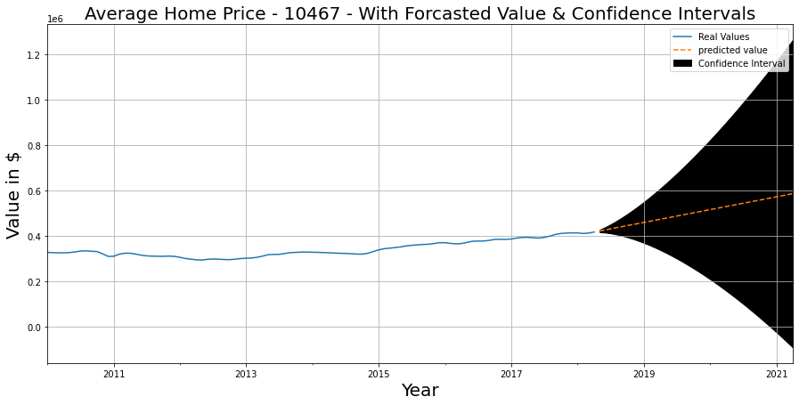
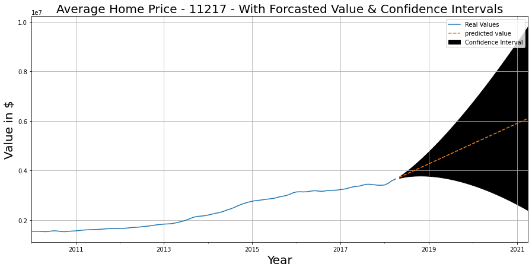
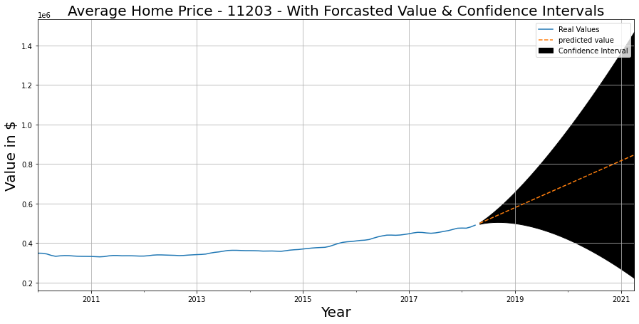
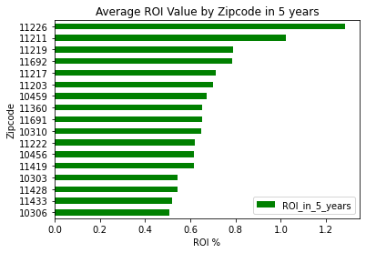

# New York City Time Series

## Overview

New York City is known to be the most exciting city to live in for its diversity, culture, and opportunity. Since NYC is a metro for homes and apartment rentals, our goal as a real estate agency in New York City is to find areas in NYC that has potential investing value. For this analysis, we are given [data](https://www.zillow.com/research/data/) from Zillow to investigate our top zip codes. Throughout our analysis, we will use return on investment, time series modeling, and average value to decipher the zip codes and boroughs in NYC that will generate profit.

## Business Problem

Our main questions to answer will be:

- Which zip codes will bring profit in the future?

- What codes based on our data has the highest ROI and will it continue to generate profit?

## Business Value

- Why is this information important for our client? 

We are looking to determine which zip codes holds future value based on prior historical information provided by Zillow's [Data](https://www.zillow.com/research/data/). The outcome is provide home value analysis for aspiring landlords, home owners and property investers on which areas in NYC that will bring the best return on investment.

## Data Understanding

We filter and sort out our data by city and chose:

- 114 zipcodes in NYC
- 8 years after 2009

## Modeling

We chose the auto arima to help us tune the parameters for our SARIMA models for a 8 year period in our data. The list of zip codes chosen were based on future ROI 3 years into the future. It was shown that ~95%-99% of the explained variance captures confidence on our model's results.

## Reccomendations

When getting our model results for next 3 years for our models for our top Zip Codes forecasted that zip codes 11226, 11211, 11219, 11692, 11217, 11203 are forecasted to increase. Our chosen model  metrics explained variance is used reflect the variance of the whole data. We use this metric to measure the variability of the predictions in our SARIMA models which finds the difference between expected value and predicted value. Our model must have at least have a 60% of explained variance. The average explained variance for these zipcodes are ~95%-99% meaning we are confident models predicted well for these zip codes. 

When choosing our zip codes we chose the zip codes with the highest return on investment for the next 5 years with the percentages given below.

- 11226: Flatbush, Brooklyn (ROI 1.28%)
- 11211: Williamsburg, Brooklyn (ROI 1.02%)
- 11219: Borough Park, Brooklyn (ROI .78%)
- 11692: Arverne: Queens (ROI .78%)
- 11217: Downtown Brooklyn, Brooklyn (ROI .71%)
- 11203: East Flatbush, Brooklyn (ROI .70%)

We recommend investing in boroughs such as Brooklyn and Queens since they are known residential boroughs.

